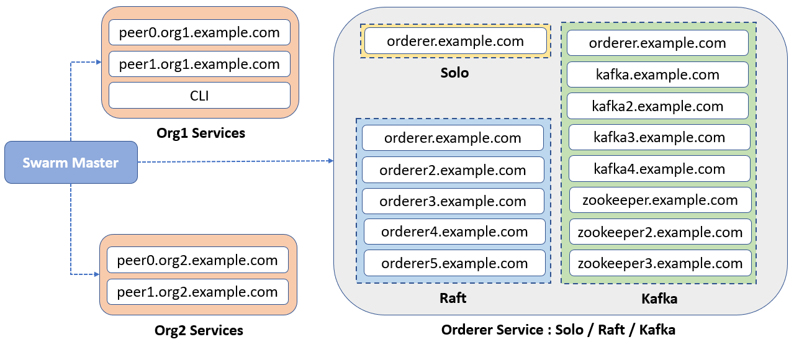

## Fabric Network Orchestration Tool 
This tool helps to setup Hyperledger Fabric Network by using Docker Swarm. By default, tool provides support to ordering service based on Solo, Kafka and Raft mode.

**Tool Includes**
* Support to multi VM Fabric Network setup.
* Ordering service based on Solo, Kafka and Raft mode.
* Sample docker compose files for Orderer, Zookeeper, Kafka, Peer and CLI service.

### Installation Guide
Kindly install all the [Prerequisites](https://hyperledger-fabric.readthedocs.io/en/release-1.4/prereqs.html) mentioned on the official documentation. Make sure we have all the Docker Images downloaded locally.
For exploration, we will take 4 VM with below specification.

|Organisation | VM Specification|
|-------------|-----------------|
|Swarm Master | 8GB, 2 vCPU     |
|Org1         | 8GB, 2 vCPU     |
|Org1         | 8GB, 2 vCPU     |
|Orderer      | 16GB, 4 vCPU    |



**# Step 1**

Clone the git repository on all the VM as below.

```bash
   git clone https://github.com/dineshrivankar/fabric-network-on-swarm.git
```

**# Step 2**

Login to the Swarm Master VM and setup Swarm Network by running the below script from home directory of the cloned repository.

```bash
    ./swarm/setup-swarm-network.sh
```
After successful execution of the script, copy the join token and run on other VM to create Swarm Network.

Once all desired VM joins the Network, verify by running the below script on Swarm Master VM.

```bash
    ./swarm/list-nodes.sh
```

Create an overlay network to communicate in the Swarm Network.

```bash
     ./swarm/setup-docker-network.sh
```

**# Step 3**

Now edit the .env file to add the Hostname Configuration. If you are not aware of the Hostname, kindly use the details shown after running `./swarm/list-nodes.sh`  

```bash     
    ORDERER_HOSTNAME=<orderer_hostname>
    ORG1_HOSTNAME=<org1_hostname>
    ORG2_HOSTNAME=<org2_hostname>
```

**# Step 4**

Generate Crypto material for all the participants by running the below script. Kindly note that we need to provide the orderer type with -o option.

```bash
     ./generate-crypto.sh -o solo
```

The above script will populate the Hostname in all the Docker Compose file and then run the `cryptogen` and `configtxgen` tool for creating crypto material, genesis block and channel tx files.
Move the newly created files (`crypto-config/` and `config/`)on other VM's under root directory of the repository.

**# Step 5**

Copy Crypto material to standard path for Docker Engine to mount on the container. Run the below script on all the VM connected to the Swarm Network. 

```bash
     ./copy-crypto.sh
```

**# Step 6**

From Swarm Master VM, run the below command to start all the nodes. This will start the Docker Service and host the nodes on respected VM.

```bash
     ./deploy.sh -o solo
```

**# Step 7**

Login to Org1 VM to create channel and deploy Chaincode. Org1 runs a cli container, `run.sh` script will do below activity:
1. Create a channel.
2. Join all peers from Org1 and org2.
3. Install Chaincode.
4. Instantiate Chaincode.
5. Invoke transaction.
6. Query transaction.

```bash
     ./run.sh
```

Repeat step 4 to 7 for deploying different types of Ordering Services. Don’t forget to reset the network by running below script on Swarm Master VM
```bash
     ./reset.sh
```


That’s it!

Feel free to submit a PR.
